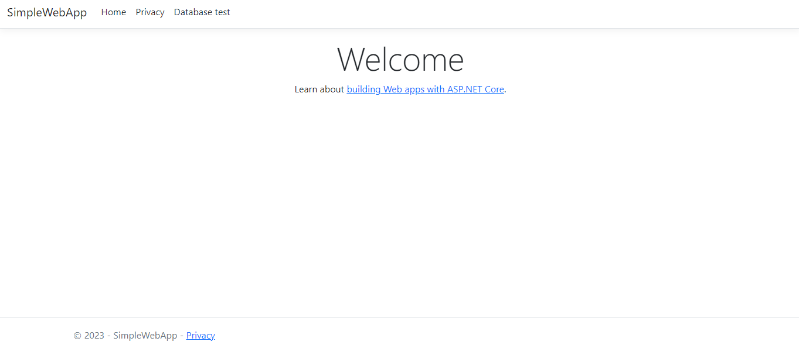
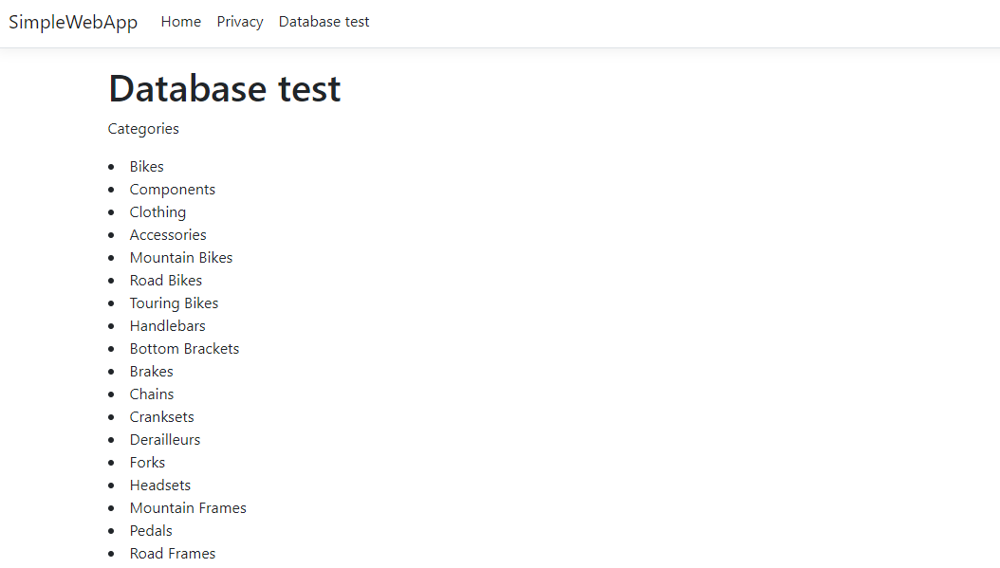

# App Services sample workload

This GitHub repository contains a simple web application sample that connects to an Azure SQL Database. The sample application supports reference implementations of articles published in the Azure Architecture Center (AAC).
It supports App Service references implementations.

- App Service Simple Web App (coming soon)
- [App Service Baseline implementation](https://github.com/Azure-Samples/app-service-baseline-implementation)

## Features

This project framework provides the following features:

- Home Page
  
- A page which show database Product Categories to show connectivity
  

## Getting Started

### Prerequisites

- [.Net 6.0](https://dotnet.microsoft.com/download/dotnet/6.0)
- [Visual Studio Community 2022](https://visualstudio.microsoft.com/vs/community/)
- [Adventureworks database example](https://learn.microsoft.com/sql/samples/adventureworks-install-configure)

### Installation

1. Install [Adventureworks database example](https://learn.microsoft.com/sql/samples/adventureworks-install-configure)
1. Get connnetion string and add it on appsettings.json
1. Open SimpleWebApp.sln with Visual Studio

> :warning: there is a already compiled version (SimpleWebApp.zip) which is going to be used in the reference implementations.
